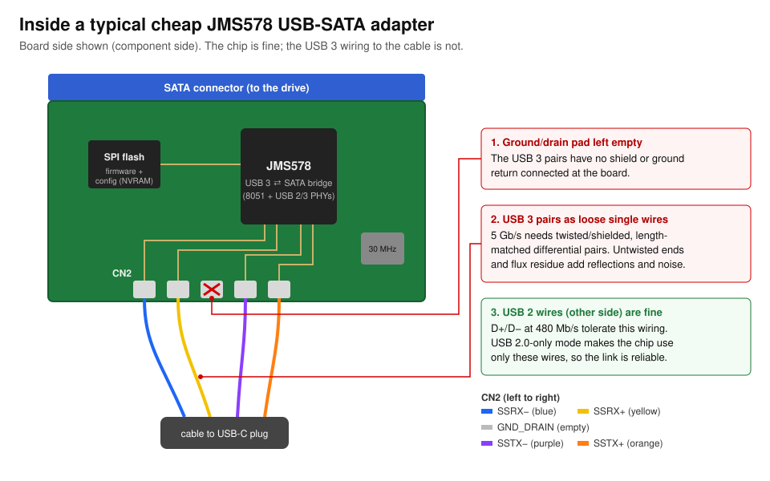
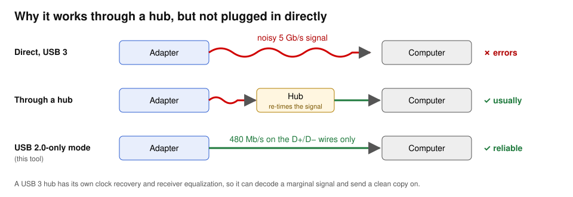

# jms578-usb2-fix

[](https://github.com/dacevedo12/jms578-usb2-fix/actions/workflows/ci.yml)

**Fix cheap USB-to-SATA adapters that don't work over USB 3.** It switches their JMicron **JMS578** chip to USB 2.0-only
mode. A verified backup is saved first, and you can undo it at any time.

Sounds like yours?

- The drive **isn't recognized on a Mac**, or it **disconnects in a loop**.
- It **works through a USB hub** or dock, or on Windows, but **not plugged in directly**.
- On Linux or a Raspberry Pi you see `uas_eh_abort_handler` or `reset SuperSpeed USB device`, or the drive only works
  with `usb-storage.quirks=...:u`.

## Fix it

1. **Download** the latest release for your computer (macOS or Linux):

   ```sh
   curl -fsSL "https://github.com/dacevedo12/jms578-usb2-fix/releases/latest/download/jms578-usb2-fix-$(uname -m | sed s/arm64/aarch64/)-$(uname -s | sed 's/Darwin/apple-darwin/;s/Linux/unknown-linux-gnu/').tar.gz" | tar xz
   cd jms578-usb2-fix
   ```

   Or pick a file from [Releases](https://github.com/dacevedo12/jms578-usb2-fix/releases), or
   [build from source](#build-from-source).

2. **Connect the adapter through a USB hub**, with its drive attached. Any USB 3 hub, dock or multiport adapter works,
   as does a USB 2.0 port.

3. **Run it and follow the prompts:**

   ```sh
   sudo ./jms578-usb2-fix
   ```

   At the end it asks you to plug the adapter in directly, and confirms that your drive is back.

**To undo:** `sudo ./jms578-usb2-fix restore`

Want to see the steps first? `./jms578-usb2-fix --simulate` rehearses everything with a simulated adapter and doesn't
touch your hardware.

**Trade-off:** the adapter then runs at USB 2.0 speed (about 35-40 MB/s) everywhere.

---

## Details

### Why it happens

The chip is fine. The **USB 3 wiring is cheap**: the SuperSpeed pairs are loose wires with no shield or ground. USB 3
runs at 5 Gb/s and can't tolerate that, while USB 2 uses separate wires that cope fine.



A hub hides the problem, because it re-drives the signal with its own clock:



The JMS578 firmware has a built-in **"USB 2.0 only"** option: bit 5 of configuration byte `0xF3`. With it on, the chip
never tries USB 3. It reports itself as a USB 2.0 device and uses only the wires that work. The evidence is in
[research/FINDINGS.md](research/FINDINGS.md).

### Is my adapter supported?

If it uses a **JMicron JMS578** bridge, it's very likely supported. That chip is common in no-name SATA cables and
enclosures. Its USB ID is `152d:0578`, or a reused one such as `7825:a2a4` ("ULT-Best / Best USB Device").
`sudo jms578-usb2-fix status` checks it without changing anything. The tool refuses to touch anything it doesn't
recognize.

### What the tool does

1. **Finds the adapter.** If it's on a USB 3 link behind a hub, the tool asks the hub to run that one port at USB 2.0
   while it works, then switches it back at the end. This is a standard USB hub request. If the adapter is plugged in
   directly over USB 3, the tool stops and explains what to do, because that link only ends in a disconnect loop.
2. **Offers to eject the drive** if it's mounted. Nothing proceeds until you agree.
3. **Checks, read-only, that it understands this adapter.** It continues only if every check passes:
   - the bridge answers JMicron's vendor commands;
   - the flash chip is a known part;
   - the firmware header and **all of its CRCs** are valid;
   - the configuration block has the signatures the firmware requires;
   - the firmware code contains the USB 2.0-only logic. The tool looks for the actual instructions, not just a
     version number.
4. **Saves a backup** of the firmware and configuration to `~/JMS578-backups`. The flash is read twice and the two
   reads are compared. The saved file is then reloaded and verified.
5. **Shows the exact change** (one byte: `0xC0 -> 0xE0`) and waits for you to type `yes`.
6. **Writes only the configuration sector**, never the firmware, then reads it back and compares.
7. **Asks you to plug the adapter in directly** and confirms that it reports USB 2.0 and the drive appears.

`sudo` is needed because the tool takes the adapter over from the system's storage driver while it works. The drive
comes back automatically afterwards.

### Commands

| Command | What it does |
|---|---|
| `sudo jms578-usb2-fix` | Guided fix (same as `fix`). |
| `sudo jms578-usb2-fix restore [FILE]` | Put a backup back (undo). Without `FILE`, choose one from `~/JMS578-backups`. Checks first that the backup came from this adapter and firmware. |
| `sudo jms578-usb2-fix status` | Identify the adapter and show whether USB 2.0-only mode is on. Read-only. |
| `sudo jms578-usb2-fix backup` | Save a verified backup. Read-only. |
| `--backup-dir DIR` | Use another backup folder. |
| `--simulate` | Run any command against a simulated adapter. |

Commands in this section assume the tool is on your `PATH`; from the downloaded folder, use `./jms578-usb2-fix`.

### Build from source

With [Rust](https://rustup.rs) installed:

```sh
cargo install --git https://github.com/dacevedo12/jms578-usb2-fix
```

### About the release binaries

Each archive has a `.sha256` file to verify it. The macOS binaries are not notarized by Apple: downloading with
`curl` as shown above works as is, but if you download one with a browser, run
`xattr -d com.apple.quarantine jms578-usb2-fix` before using it.

### FAQ

**Can this brick my adapter?** The firmware is never touched. Only the 512-byte configuration block is rewritten, and
only after every check has passed. If a write is ever interrupted, the adapter still boots, and `restore` puts the
original back. As a last resort, JMS578 boards can be recovered by temporarily grounding the flash chip's data-out pin
(see [jms578flash](https://github.com/BertoldVdb/jms578flash#readme)).

**Is the data on my drive at risk?** The tool never reads or writes the drive; it only talks to the adapter chip. It
asks you to eject the drive first, so nothing is mid-copy.

**Which systems are supported?** macOS, tested end to end on Apple Silicon. Linux builds and passes the same tests but
hasn't been tried on real hardware yet. Windows isn't supported, because its storage driver can't be detached the
same way.

**My adapter uses a different chip (ASMedia, VIA...).** The tool won't touch it. The same idea may apply, but those
chips store their configuration differently.

**I'd rather fix the hardware.** Rewire the USB 3 pairs with a properly shielded cable and connect the drain wire to
the middle `CN2` pad. Then run `restore` to turn USB 3 back on.

### How it was built

The investigation is written up in [research/FINDINGS.md](research/FINDINGS.md): USB traces, register snapshots and
an 8051 disassembly of the firmware. It includes a small disassembler, so you can check the claims against a backup of
your own adapter. The tool is tested against a software model of the JMS578 and its flash chip, including the hardware
quirks that make flash writes risky. CI runs those tests on macOS and Linux, along with formatting, lint and an
end-to-end `--simulate` run.

### Credits

- [jms578flash](https://github.com/BertoldVdb/jms578flash) by Bertold Van den Bergh (MIT) documented the JMS578
  vendor commands, flash layout and firmware checksums this tool relies on.
- Found and built while rescuing a "ULT-Best" SATA cable that only worked through a hub.

### License

[MIT](LICENSE)
